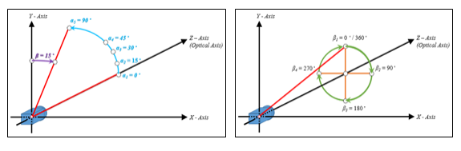

Definition and Overview
#######################

1.1 What is MoilApp
===================

.. raw:: html

   

    MoilApp is a fisheye image processing software developed by MOIL-Lab. This application is an implementation of Moildev SDK
    as a sophisticated method of processing fisheye images. The commonly used is to process fisheye image with the result
    panorama view and Anypoint view. This sophisticated methodology for image processing is very useful in a variety of applications
    that require high image quality and wide-angle FoV.

1.2 Fisheye lens technology
===========================

.. raw:: html

   

    The fisheye lens also terms fisheye image sensor (FIS) is a unique super wide-angle lens with a short focal length that produces
    strong visual distortion intended to create a wide panoramic or hemispherical image. The most significant feature is the field of view vast.
    A fisheye camera (also termed a fisheye image sensor, FIS) can capture a clear image with a FOV of over 180 degrees, but a severer barrel distortion comes along.

.. raw:: html

   

    Based on Prof Chuang-Jan Chang, the method for presenting fisheye camera images is integrating the multicollimator metrology and
    cartography in order to systematically describe the projection mechanism of the fisheye camera. The fisheye camera in our proposed method
    generates the hemisphere coordinate system. Hence, the position of an imaged point referring to the principal point on the image plane directly
    reflects its corresponding Zenithal distance a. and azimuthal distance β of the sight ray in space so as to normalize the imaged point onto a
    small sphere presented through figure bellow:

.. figure:: assets/1.Hemisphere_coordinate_system.jpg
   :scale: 60 %
   :alt: alternate text
   :align: center

    Hemisphere coordinate system

.. raw:: html

   

    According to the coordinate system, the angles respectively defined by incident rays and the optical axis is the zenithal angle of [Persamaan],
    and [Persamaan] (beta) is the azimuthal angle,  which are the angles Surrounding the optical axis. It has relation with the coordinate system X, Y, Z,
    where the optical axis is defined by Z-axis. For the zenithal angle, it is the angle from the vertical optical axis to the X-axis and Y axis, as shown in figure 3.a.
    Whereas the azimuthal angle is defined as the angle of positive Y as the reference point with value 0 degrees and the Z-axis is used as the rotation axis, as shown in figure 3.b.
    the rotation around the optical axis is the angle of the Y axis starting from positive direction and clockwise around the X axis.

   Operations of the MoilApp

1.3 What is Anypoint view
=========================

.. raw:: html

   

    This method converts the image plane coordinate to hemispherical coordinates, moves the optical axis to the specified zenithal (alpha)
    and azimuthal (beta) angle based on the coordinate given. the Anypoint view is an image that has been undistorted in a certain area according
    to the input coordinates.

1.4 What is Panorama view
=========================

.. raw:: html

   

    The panoramic view may present a horizontal view in a specific immersed environment to meet the common human visual perception.
    A panoramic view is like unfold the hemisphere image. Here, Figure 4(a) shown the fisheye image model and Figure 4(b) shown the mapping plane
    of the panoramic view. The horizontal axis in the target plane is the longitude and the vertical axis is the latitude of spherical coordinate.
    The maximum radius of longitude angle also called beta (β) is [Persamaan] and the latitude or alpha (α) is a half of Field of View (FoV) camera
    where in this study camera lens have FoV 220 degree. We set the alpha and beta is 0 then we calculate with our method formula then the fisheye image
    can be expanded to the desired panorama image.

   Operations of the MoilApp

1.5 What is the use of this app?
================================

.. raw:: html

   

    Currently, the use of fisheye camera technology has been widely used in various fields such as 3D measurement, medical, ADAS system and others.
