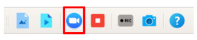
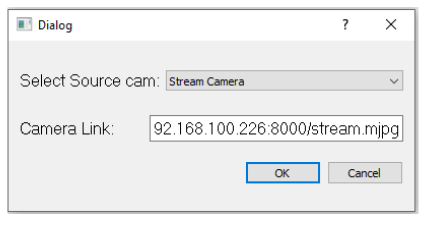

Operation Moilapp
#################

   Moildev Apps

1. Menu bar
===========

   Menu bar

.. raw:: html

   

    The menu bar's purpose is to supply a common housing for window- or application-specific menus which provide access to such functions as opening files, interacting with an application, or displaying help documentation or manuals. 

1.1 File
---------

    a. File has six features:

    b. Load Image

    c. Load Video

    d. Open Cam

    e. Close Cam

    f. Save Image

    g. Record Video

    h. Exit

1.2 View
---------

    a. This menu was using to view or hide some windows

    b. Save Image box

    c. Toolbox

1.3 Window
----------

    a. Window menu was used for maximized and minimized result windows.

    b. Maximized

    c. Maximized was using to make result windows bigger and will hide image save window and toolbox.

    d. Minimized

    e. Minimized was using to make result windows be the default size

1.4 Help
--------

.. raw:: html

   

    If a user had confused about the application, they can see the help menu. 

    a. Current widget Lab

.. figure:: assets/4.help.png
   :scale: 80 %
   :alt: alternate text
   :align: center

   Operations of the MoilApp

    b. Current widget lab is used to provide information about the moildev application

   About Moil-Lab

2. Toolbar
===========

.. figure:: assets/6.toollbar.png
   :scale: 110 %
   :alt: alternate text
   :align: center

   Operations of the MoilApp

.. raw:: html

   

    Tips: If you are mising the toolba, try clicking View on the manubar. There is option where the toolbar and Image saved view can be hiden and display.

3. Load Image
=============

.. raw:: html

   

    To load the image, click on “Load image” in the toolbar and choice the image and parameter of an image. 

   Operations of the MoilApp

   Operations of the MoilApp

.. raw:: html

   

   After clicking "load image" on the toolbar. first, select the location where the image will be processed. second, select the image, and then click open for the third step. 

   Operations of the MoilApp

.. raw:: html

   

    After inputting the image then select a parameter. First, open the directory where the image parameters are. second, select the parameters to be used. Last was clicked open. 

   Operations of the MoilApp

After all the processes are complete, a display will appear as shown on the side. Any point and panorama are still not enabled by default. the user has to choose what kind of process the user wants. 

.. raw:: html

   

    Note: Make sure the parameters and images used are in the same camera. Otherwise, the process will not procees properly.

4. Load Video
=============

.. raw:: html

   

    Just like load image, to load video from our directory click “load Video” in the toolbox. 

   Operations of the MoilApp

   Operations of the MoilApp

   Operations of the MoilApp

.. raw:: html

   

    After Click the “load videos” from the directory button, then selecting the video (Fig.14) to be processed and selecting the parameters (Fig.15) used. 

.. raw:: html

   

    Note: Make sure the parameters and videos sed are in the same camera. otherwise, the process will not proceed properly.

5. Open Cam
===========

.. raw:: html

   

    Moildev had two sources for cam, first from USB camera and the second was stream camera (Web camera). For open camera click Open cam in the toolbar. 

   Operations of the MoilApp

- USB Camera

.. figure:: assets/15.choice_usb_camera.png
   :scale: 110 %
   :alt: alternate text
   :align: center

   Operations of the MoilApp

Input from USB camera we must check the port for every camera on our computer.

   Operations of the MoilApp

.. raw:: html

   

    Note: Make sure when choosing a USB camera you know the activate camera number. Each camera has a different array number. By default [0] is camera a camera that is already on laptop or computer (main camera), if you using another camera it will be [1], [2] and so on.

Stream Camera
-------------

   Operations of the MoilApp

Input from web camera we must input the camera link and click “OK”

   Operations of the MoilApp

.. raw:: html

   

    Note: Make sure when choosing a web camera you know the camera link or URL. Each camera has a different link.

6. Video Player
================

.. raw:: html

   

    Video player was using to control video from the directory or stream camera (USB camera dan WEB camera) 

   Operations of the MoilApp

- Rewind (rewind video for 5 seconds)

- Play / Pause

- When press the play button and will change to the pause button and turn back after that.

- Stop

- Forward (forward video for 5 seconds)

- Length of Video

7. Any Point
============

.. figure:: assets/21.anypoint_mode.png
   :scale: 110 %
   :alt: alternate text
   :align: center

   Any point mode

.. raw:: html

   

    Any point has 2 setting parameters and a fast view. At any point, we have alpha and beta parameters. User must input of value Alpha and Beta and picture will show image depends on the parameter. Fast view had fixed alpha and beta parameters and just only click the direction apps can show the images. 

   Pitch, Yaw, and Roll axis

.. raw:: html

   

    Mode 1 and mode 2 are modes that use changes in the angle of rotation of pitch, yaw, and roll. Mode 1 takes advantage of changing the pitch and roll angle. Mode 2 changes based on Raw and roll angle. 

Mode 1
-------

   fugure a

   figure b & c

.. raw:: html

   

    (a) The default setting when first-time clicks Any Point was mode 1 with alpha and beta parameters was 0O. (b) If the user clicks “up arrow” then alpha parameter will change to 75O automatically and beta still zero. (c) alpha and beta will change to 65 O and 270 O degrees if we click on the “left arrow” side. 

Mode 2
-------

   figure a

   figure b & c

.. raw:: html

   

    (a) Mode 2 by default with alpha and beta parameters was 0O. (b) If the user clicks “Up Arrow” then alpha parameter will change to 50O automatically and beta still zero. (c) alpha and beta will change to 0O and -75 O degrees if we click on the “Left Arrow”.

Panorama
--------

   panorama view

.. raw:: html

   

    Panorama can be created from wide-angle images to panoramic images. Field of view (FoV) is the extent of the observable world visible at any given moment. 

.. figure:: assets/
   :scale: 110 %
   :alt: alternate text
   :align: center

   Operations of the MoilApp

.. figure:: assets/27.wide_image_to_panorama_view.png
   :scale: 110 %
   :alt: alternate text
   :align: center

   Wide image to panorama view

Panorama view changes the view from a wide view image to a panoramic view.

Record video and save image
---------------------------

.. raw:: html

   

    Moildev can record video and save image capture from video. To record a video, click the “rec” menu on the toolbar. 

   Operations of the MoilApp

To save the image press the save image button on the toolbar.

   Operations of the MoilApp

Help
----

.. raw:: html

   

    Help is used when the user needs additional information and confusing information. There are two pieces of information provided, the first is Application Help and the second is about moildev apps. 

   Operations of the MoilApp
